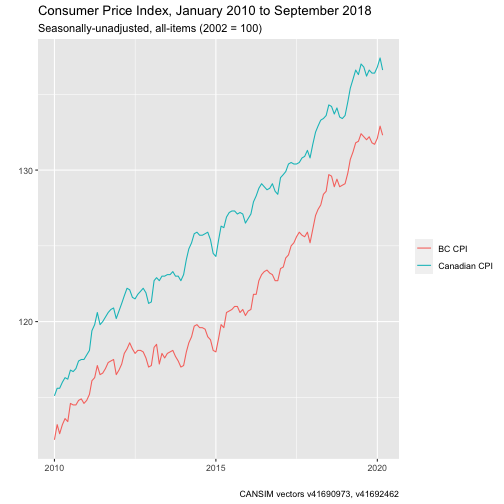

### Retrieving individual vectors 

Many of the time-series data available from Statistics Canada have individual vector codes. These vector codes follow a naming format of a lower-case "v" and an identifying numbers. Time-series tables will often bundle many series together, resulting in large and sometimes unwieldy files. Many users of Canadian statistical data, who are often concerned with specific time series such as the CPI or international arrivals, will typically know the exact series they need. For this reason, the `cansim` package also provides two functions to make it easier to retrieve individual vectors: `get_cansim_vector()` and `get_cansim_vector_for_latest_periods()`. 

### get_cansim_vector()

Running `search_cansim_tables("consumer price index")` shows 35 tables as results. However, if you are tracking the Canadian Consumer Price Index (CPI) over time, you might already know the Statistics Canada vector code the seasonally-unadjusted all-items CPI value: *v41690973*. To retrieve just this data series on its own without all of the additional data available in related tables, we can use the `get_cansim_vector()` function with the vector code and the date onwards from which we want to get vector results for.

```r
get_cansim_vector("v41690973","2015-01-01")
#> Accessing CANSIM NDM vectors from Statistics Canada
#> # A tibble: 75 x 9
#>    DECIMALS VALUE REF_DATE   releaseTime      SYMBOL frequencyCode SCALAR_ID COORDINATE          VECTOR   
#>       <int> <dbl> <chr>      <chr>             <int>         <int>     <int> <chr>               <chr>    
#>  1        1  124. 2015-01-01 2018-06-12T08:30      0             6         0 2.2.0.0.0.0.0.0.0.0 v41690973
#>  2        1  125. 2015-02-01 2018-06-12T08:30      0             6         0 2.2.0.0.0.0.0.0.0.0 v41690973
#>  3        1  126. 2015-03-01 2018-06-12T08:30      0             6         0 2.2.0.0.0.0.0.0.0.0 v41690973
#>  4        1  126. 2015-04-01 2018-06-12T08:30      0             6         0 2.2.0.0.0.0.0.0.0.0 v41690973
#>  5        1  127. 2015-05-01 2018-06-12T08:30      0             6         0 2.2.0.0.0.0.0.0.0.0 v41690973
#>  6        1  127. 2015-06-01 2018-06-12T08:30      0             6         0 2.2.0.0.0.0.0.0.0.0 v41690973
#>  7        1  127. 2015-07-01 2018-06-12T08:30      0             6         0 2.2.0.0.0.0.0.0.0.0 v41690973
#>  8        1  127. 2015-08-01 2018-06-12T08:30      0             6         0 2.2.0.0.0.0.0.0.0.0 v41690973
#>  9        1  127. 2015-09-01 2018-06-12T08:30      0             6         0 2.2.0.0.0.0.0.0.0.0 v41690973
#> 10        1  127. 2015-10-01 2018-06-12T08:30      0             6         0 2.2.0.0.0.0.0.0.0.0 v41690973
#> # … with 65 more rows
```

The call to `get_cansim_vector` takes three inputs: a string code (or codes) for `vectors`, a `start_time` in YYYY-MM-DD format, and an optional value for `end_time`, also in YYYY-MM-DD format. By default, the `start_time` and `end_time` vectors uses Statistics Canada's reference periods ("REF_DATE") for selecting the date range of the data for retrieved vectors. There are a few optional input parameters for this function. If `end_time` is not provided, the call will use the current date as the default series end time. If the optional parameter `use_ref_date` is set to `FALSE`, then vector retrieval will instead filter on the release date of the vector itself.

Vectors can be coerced into a list object in order to retrieve multiple series at the same time. For example, provincial seasonally-unadjusted CPI values have their own vector codes. The vector code for British Columbia all-items CPI is *v41692462*.

The below code retrieves monthly Canadian and BC CPI values for the period January 2015 to December 2017 only. Monthly data series are always dated to the first day of the month. 

```r
vectors <- c("v41690973","v41692462")

get_cansim_vector(vectors, "2017-01-01")
#> Accessing CANSIM NDM vectors from Statistics Canada
#> # A tibble: 102 x 9
#>    DECIMALS VALUE REF_DATE   releaseTime      SYMBOL frequencyCode SCALAR_ID COORDINATE          VECTOR   
#>       <int> <dbl> <chr>      <chr>             <int>         <int>     <int> <chr>               <chr>    
#>  1        1  130. 2017-01-01 2020-10-21T08:30      0             6         0 2.2.0.0.0.0.0.0.0.0 v41690973
#>  2        1  130. 2017-02-01 2020-10-21T08:30      0             6         0 2.2.0.0.0.0.0.0.0.0 v41690973
#>  3        1  130. 2017-03-01 2020-10-21T08:30      0             6         0 2.2.0.0.0.0.0.0.0.0 v41690973
#>  4        1  130. 2017-04-01 2020-10-21T08:30      0             6         0 2.2.0.0.0.0.0.0.0.0 v41690973
#>  5        1  130. 2017-05-01 2020-10-21T08:30      0             6         0 2.2.0.0.0.0.0.0.0.0 v41690973
#>  6        1  130. 2017-06-01 2020-10-21T08:30      0             6         0 2.2.0.0.0.0.0.0.0.0 v41690973
#>  7        1  130. 2017-07-01 2020-10-21T08:30      0             6         0 2.2.0.0.0.0.0.0.0.0 v41690973
#>  8        1  130. 2017-08-01 2020-10-21T08:30      0             6         0 2.2.0.0.0.0.0.0.0.0 v41690973
#>  9        1  131. 2017-09-01 2020-10-21T08:30      0             6         0 2.2.0.0.0.0.0.0.0.0 v41690973
#> 10        1  131. 2017-10-01 2020-10-21T08:30      0             6         0 2.2.0.0.0.0.0.0.0.0 v41690973
#> # … with 92 more rows
```

### get_cansim_vectors_for_latest_periods()

Some vectors extend backwards for a significant number of periods that may not be of interest. `get_cansim_vectors_for_lates_periods()` is a wrapper around `get_cansim_vectors` that takes a `periods` input instead of arguments for `start_time` and `end_time`, and provides data for the selected vector(s) for the last `n` periods for which data is available, irrespective of dates. 

```r
get_cansim_vector_for_latest_periods("v41690973", periods = 60)
#> Accessing CANSIM NDM vectors from Statistics Canada
#> # A tibble: 60 x 9
#>    DECIMALS VALUE REF_DATE   releaseTime      SYMBOL frequencyCode SCALAR_ID COORDINATE          VECTOR   
#>       <int> <dbl> <chr>      <chr>             <int>         <int>     <int> <chr>               <chr>    
#>  1        1  128. 2016-04-01 2020-10-21T08:30      0             6         0 2.2.0.0.0.0.0.0.0.0 v41690973
#>  2        1  129. 2016-05-01 2020-10-21T08:30      0             6         0 2.2.0.0.0.0.0.0.0.0 v41690973
#>  3        1  129. 2016-06-01 2020-10-21T08:30      0             6         0 2.2.0.0.0.0.0.0.0.0 v41690973
#>  4        1  129. 2016-07-01 2020-10-21T08:30      0             6         0 2.2.0.0.0.0.0.0.0.0 v41690973
#>  5        1  129. 2016-08-01 2020-10-21T08:30      0             6         0 2.2.0.0.0.0.0.0.0.0 v41690973
#>  6        1  129. 2016-09-01 2020-10-21T08:30      0             6         0 2.2.0.0.0.0.0.0.0.0 v41690973
#>  7        1  129. 2016-10-01 2020-10-21T08:30      0             6         0 2.2.0.0.0.0.0.0.0.0 v41690973
#>  8        1  129. 2016-11-01 2020-10-21T08:30      0             6         0 2.2.0.0.0.0.0.0.0.0 v41690973
#>  9        1  128. 2016-12-01 2020-10-21T08:30      0             6         0 2.2.0.0.0.0.0.0.0.0 v41690973
#> 10        1  130. 2017-01-01 2020-10-21T08:30      0             6         0 2.2.0.0.0.0.0.0.0.0 v41690973
#> # … with 50 more rows
```

### Naming vector series

In these examples, we have used *v41690973* for Canada and *v41692462* for BC. This can be hard to remember and can get annoying to work with. Both vector retrieval functions in the `cansim` package allow for named vector extraction. This works by providing a user-determined string directly into a `get_*` call. This may be useful when working with table code and vector codes that do not have any information in their name and become easy to lose track of. 

### Normalizing data

The convenience function `normalize_cansim_values()` works for data retrieved by `get_cansim_vector()` calls the same way it works for full tables retrieved by `get_cansim()` calls. While using this convenience function is entirely optional, it can save some time by adjusting vector values by their appropriate scalar (percentage) and converting character dates into standard R date objects. 

### Putting it all together

This quick example uses a list with two named vectors and a starting date as an input value, converts values ("normalizes") on the fly, and prepares a simple `ggplot2` graphic.

```r

vectors <- c("Canadian CPI"="v41690973",
             "BC CPI"="v41692462")

data <- normalize_cansim_values(get_cansim_vector(vectors, "2010-01-01"))
#> Accessing CANSIM NDM vectors from Statistics Canada

library(ggplot2)
ggplot(data,aes(x=Date,y=VALUE,color=label)) +
  geom_line() +
  labs(title="Consumer Price Index, January 2010 to September 2018",
       subtitle = "Seasonally-unadjusted, all-items (2002 = 100)",
       caption=paste0("CANSIM vectors ",paste0(vectors,collapse = ", ")),x="",y="",color="")
```


To access metadata for vectors we can use the `get_cansim_vector_info` call

```r
get_cansim_vector_info(vectors)
#> # A tibble: 2 x 10
#>   DECIMALS VECTOR  table   COORDINATE     title_en      title_fr         UOM frequencyCode SCALAR_ID title      
#>      <int> <chr>   <chr>   <chr>          <chr>         <chr>          <int>         <int>     <int> <chr>      
#> 1        1 v41690… 18-10-… 2.2.0.0.0.0.0… Canada;All-i… Canada;Ensemb…    17             6         0 Canada;All…
#> 2        1 v41692… 18-10-… 26.2.0.0.0.0.… British Colu… Colombie-Brit…    17             6         0 British Co…
```
